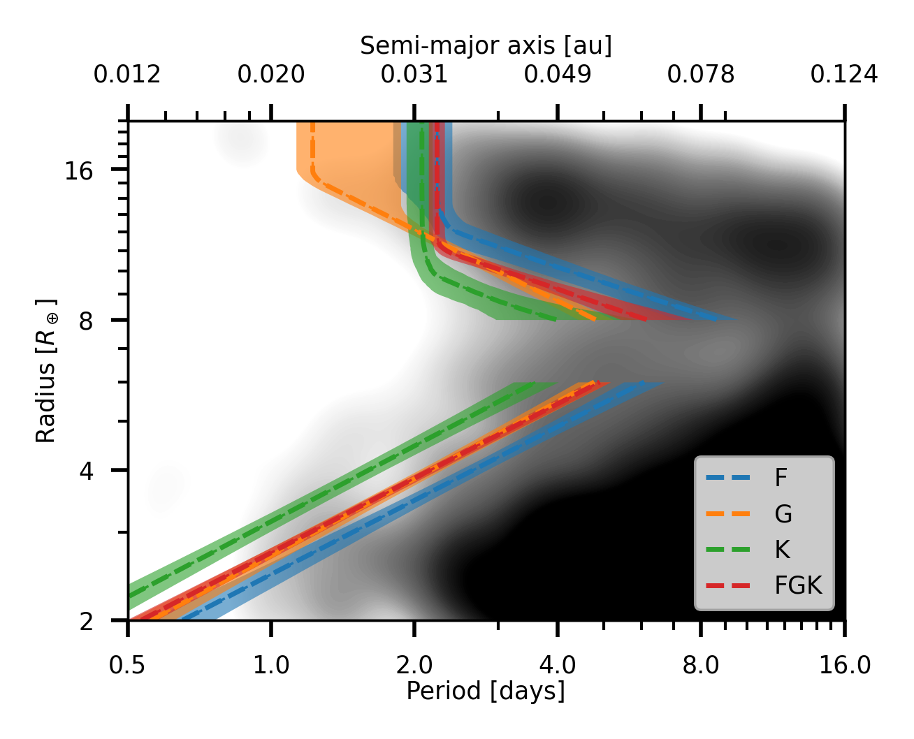
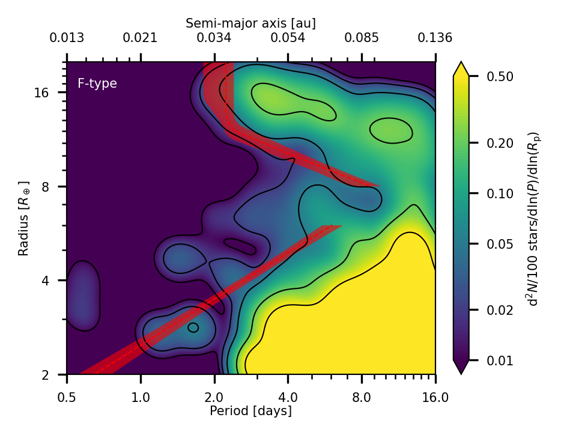
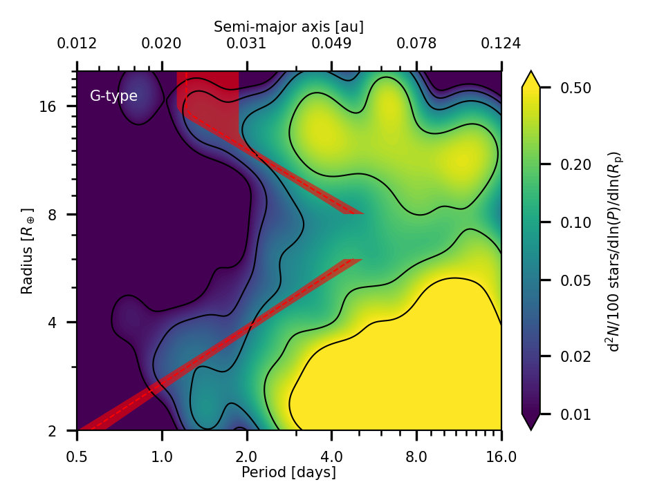
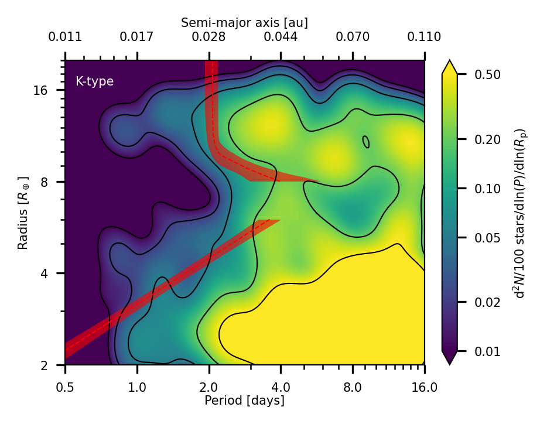
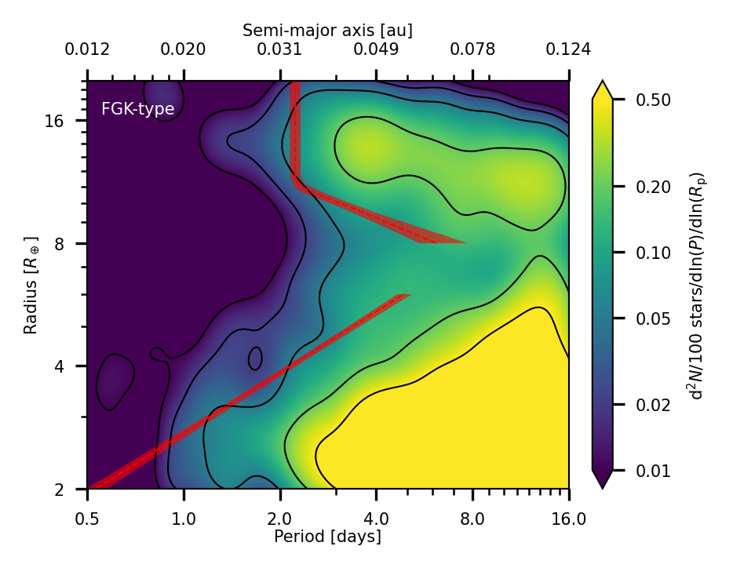

# Weighted-KDE occurrence maps and Neptunian-desert boundaries

This repository contains the notebook and processed data used to display
weighted kernel-density-estimation (wKDE) occurrence maps and fitted
Neptunian-desert boundaries for planets around F-, G-, K-, and combined
FGK-type host stars.

## Results

### Desert boundaries by spectral type

The dashed curves show the median fitted upper and lower boundaries. Shaded
regions mark the corresponding 16th–84th percentile intervals.

  

### Weighted occurrence maps

The colour scale gives the planet occurrence density per 100 stars in
period–radius space. Black lines are occurrence-density contours, while the red
dashed curves and bands show the median desert boundaries and their
16th–84th percentile intervals.

The quantified occurrence-rate results are available through our
[`interactive online tool`](https://cuikaiming.com/TESS-SPOC-Occurrence-Rate/).
For the FGK, F-, G-, and K-star samples, it reports the occurrence rate in each
period–radius cell and calculates the total occurrence, including its
uncertainty, within any selected region.

  
  

  
  

## Reproduce the figures

**No installation of this repository is needed.** Download or clone it, keep
[`wKDE-boundaries.ipynb`](wKDE-boundaries.ipynb) and
[`wkde_boundary_release.npz`](wkde_boundary_release.npz) in the same directory,
and open the notebook in a Jupyter environment. The notebook uses only NumPy
and Matplotlib. Select **Run > Run All Cells** to regenerate every figure shown
above.

The saved notebook outputs can also be viewed directly on GitHub without
running any code. The notebook documents the arrays contained in the data
archive and how they are used.

This release reproduces the figures from the supplied processed wKDE grids and
fitted-boundary summaries. The upstream catalogue analysis and construction of
these arrays will be described in the accompanying paper.

## Paper

The scientific analysis and interpretation of these results are presented in
our accompanying paper:

> ****

If you use these results, please cite the paper once it is available and refer
to the specific release of this repository used in your work.
